# Account Service Functional Test Results

This document captures the key functionality test scenarios for the `account-service` internal API.

## Test Scope

- Verify transaction processing and idempotency
- Verify balance retrieval and account details
- Verify transaction history ordering
- Validate error handling for invalid requests
- Verify health checks and core service availability

## Base URL

- `http://localhost:8081`

## Test Scenarios

### 1. Apply credit transaction

- URL: `POST http://localhost:8081/accounts/acct-123/transactions`
- Sample body:
```json
{
  "eventId": "evt-credit-001",
  "type": "CREDIT",
  "amount": 150.00,
  "currency": "USD",
  "eventTimestamp": "2026-06-14T12:00:00Z"
}
```
- Expected:
  - HTTP `201 OK`
  - Response contains current balance `150.00`
  - `X-Trace-Id` is returned in response headers if present on request
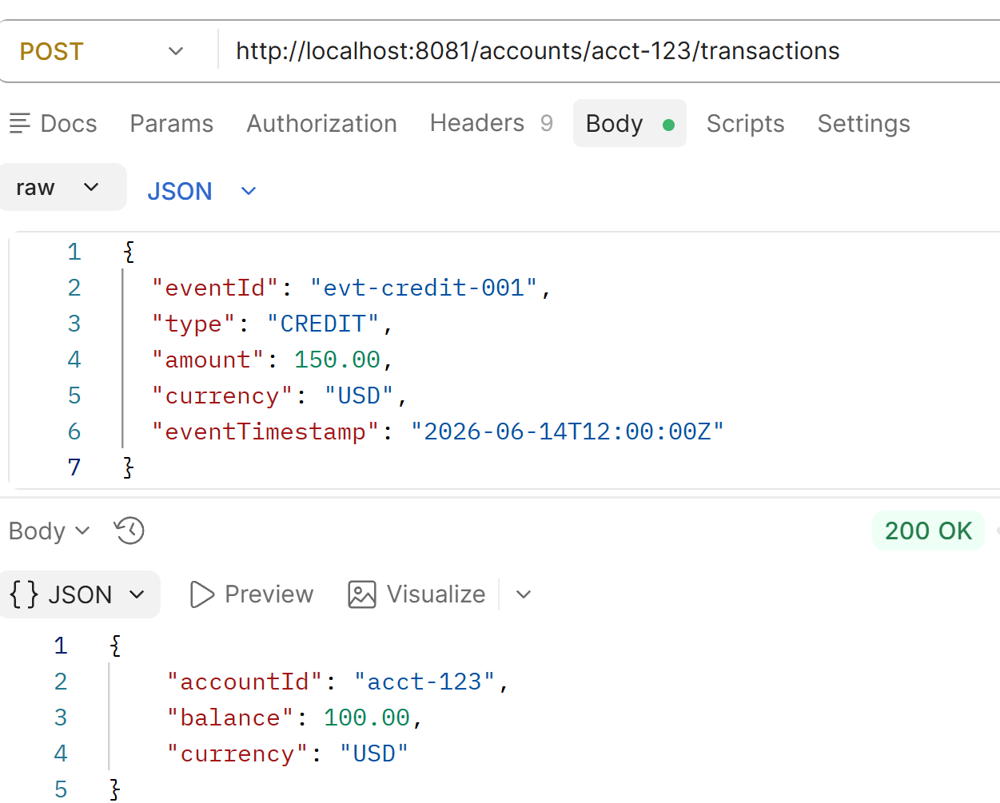
### 2. Apply debit transaction

- URL: `POST http://localhost:8081/accounts/acct-123/transactions`
- Sample body:
```json
{
  "eventId": "evt-debit-001",
  "type": "DEBIT",
  "amount": 50.00,
  "currency": "USD",
  "eventTimestamp": "2026-06-14T13:00:00Z"
}
```
- Expected:
  - HTTP `200 OK`
  - Response contains balance reduced by `50.00`
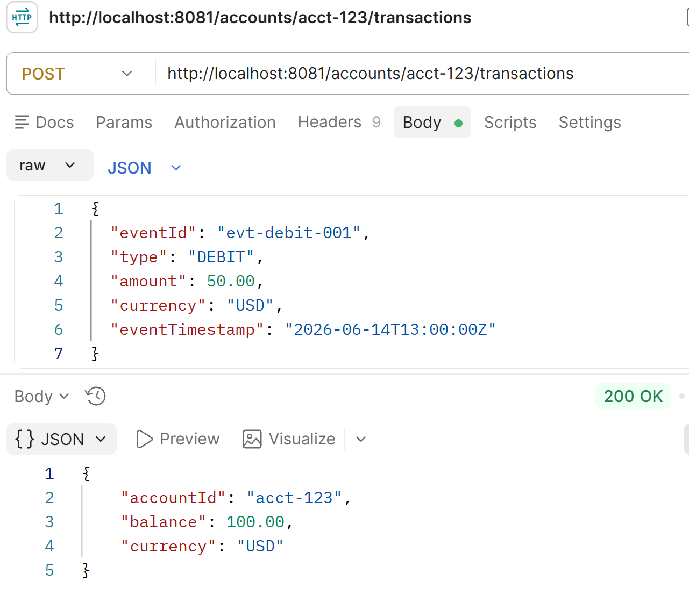
### 3. Duplicate `eventId` handling (idempotency)

- URL: `POST http://localhost:8081/accounts/acct-123/transactions`
- Sample body (same `eventId` twice):
```json
{
  "eventId": "evt-idempotent-001",
  "type": "CREDIT",
  "amount": 100.00,
  "currency": "USD",
  "eventTimestamp": "2026-06-14T14:00:00Z"
}
```
- Expected:
  - First request: HTTP `200 OK`, balance increases
  - Second request: HTTP `200 OK`, balance remains unchanged
  - Duplicate transaction not processed again
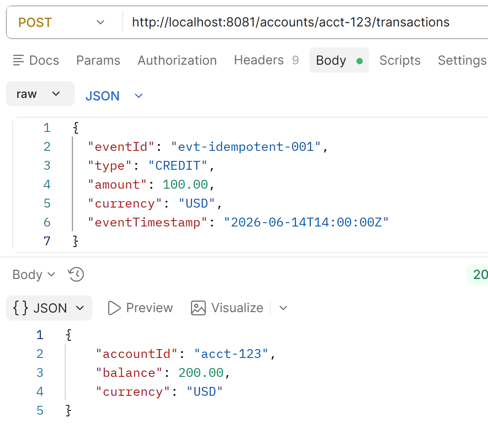
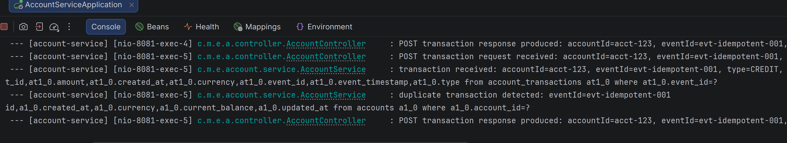
### 4. Balance retrieval

- URL: `GET http://localhost:8081/accounts/acct-123/balance`
- Expected:
  - HTTP `200 OK`
  - Response returns current account balance and currency
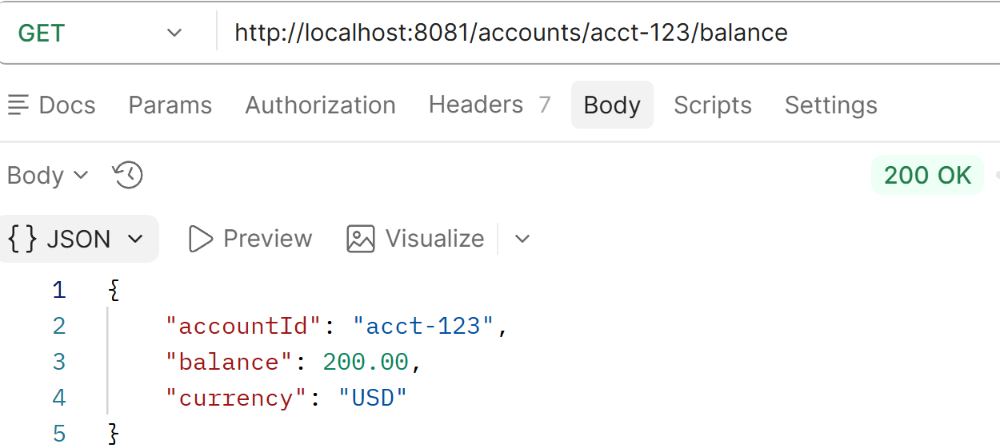
### 5. Account details and transaction history

- URL: `GET http://localhost:8081/accounts/acct-123`
- Expected:
  - HTTP `200 OK`
  - Response contains current balance, currency, and transaction list
  - Transaction list is sorted by `eventTimestamp` ascending
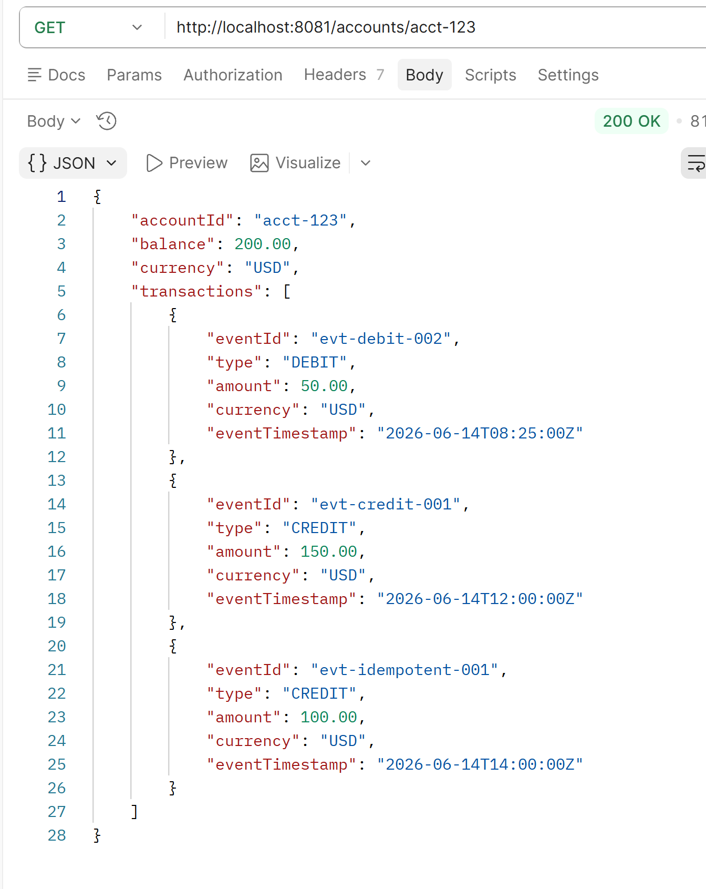
### 6. Transaction ordering resilience

- Submit two transactions out of timestamp order:
  - Later `eventTimestamp` first
  - Earlier `eventTimestamp` second
- Expected:
  - Both transactions are applied
  - `GET /accounts/{accountId}` returns transaction history sorted by `eventTimestamp`
  - Balance is correct after both transactions
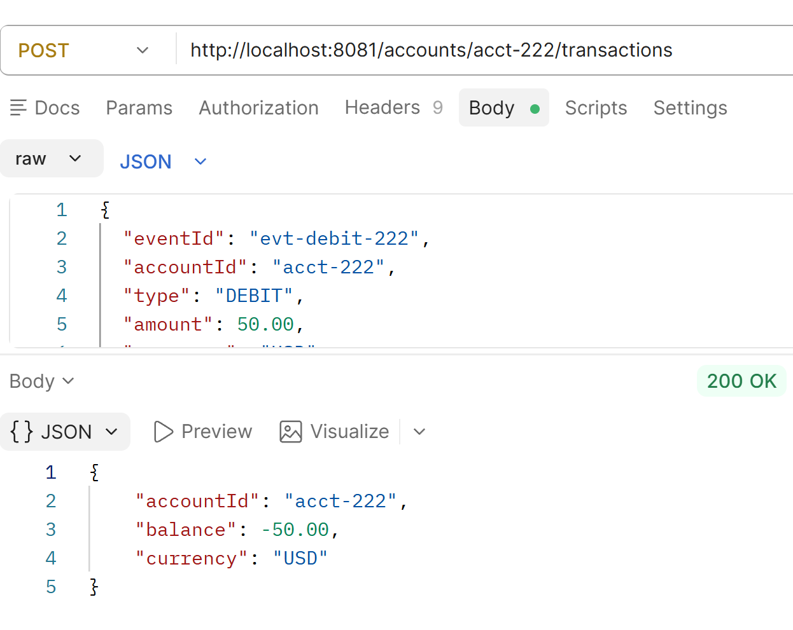
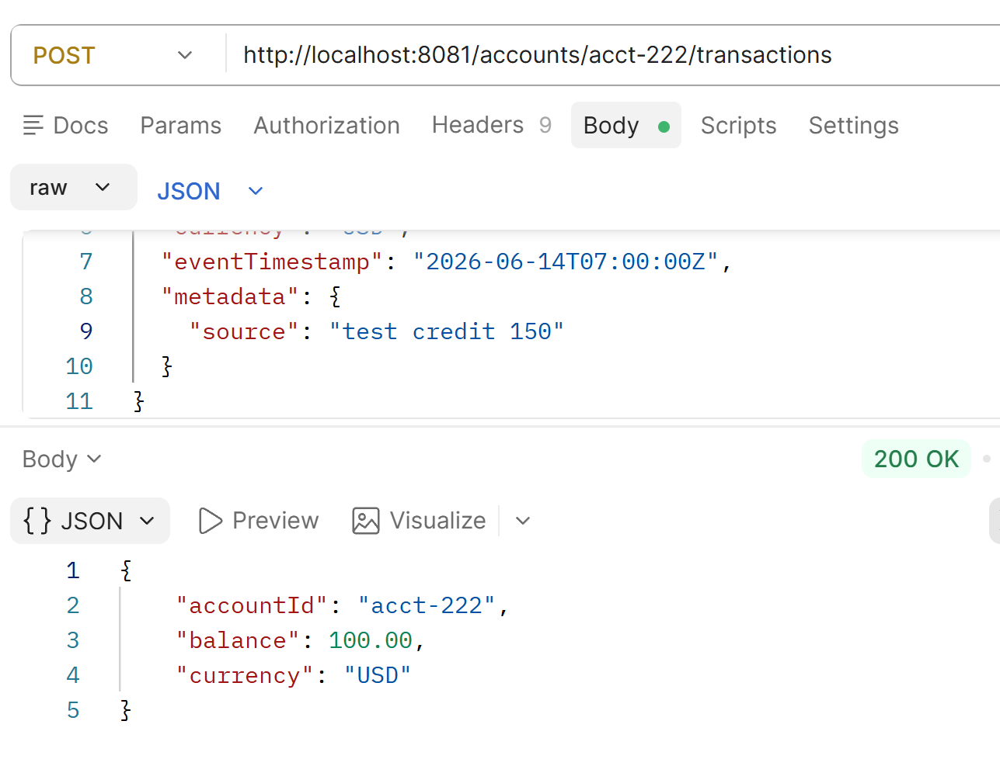
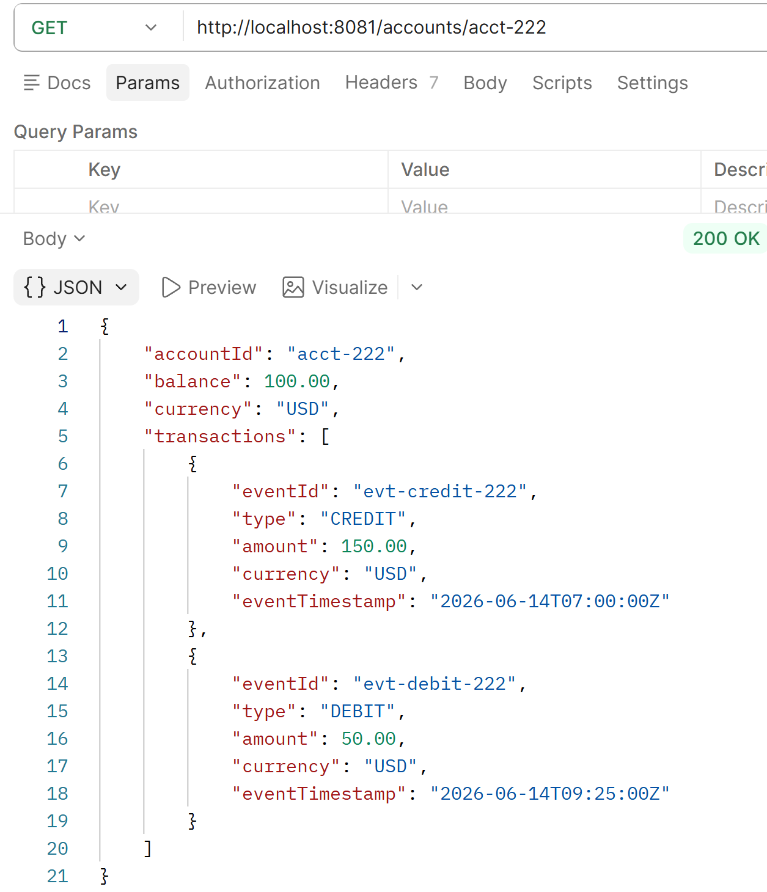
### 7. Invalid amount validation

- URL: `POST http://localhost:8081/accounts/acct-123/transactions`
- Sample body:
```json
{
  "eventId": "evt-invalid-amount",
  "type": "CREDIT",
  "amount": 0.00,
  "currency": "USD",
  "eventTimestamp": "2026-06-14T15:00:00Z"
}
```
- Expected:
  - HTTP `400 Bad Request`
  - Error indicates amount must be greater than zero
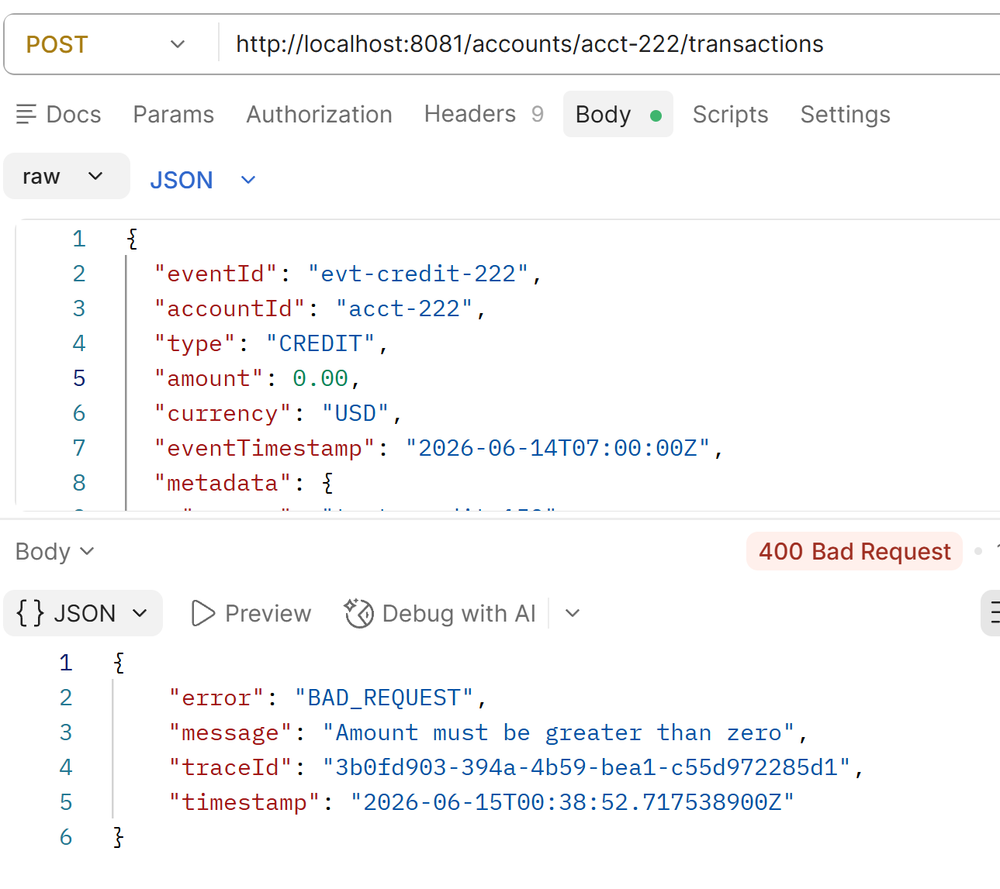
### 8. Invalid type validation

- URL: `POST http://localhost:8081/accounts/acct-123/transactions`
- Sample body:
```json
{
  "eventId": "evt-invalid-type",
  "type": "TRANSFER",
  "amount": 50.00,
  "currency": "USD",
  "eventTimestamp": "2026-06-14T15:30:00Z"
}
```
- Expected:
  - HTTP `400 Bad Request`
  - Error indicates invalid transaction type
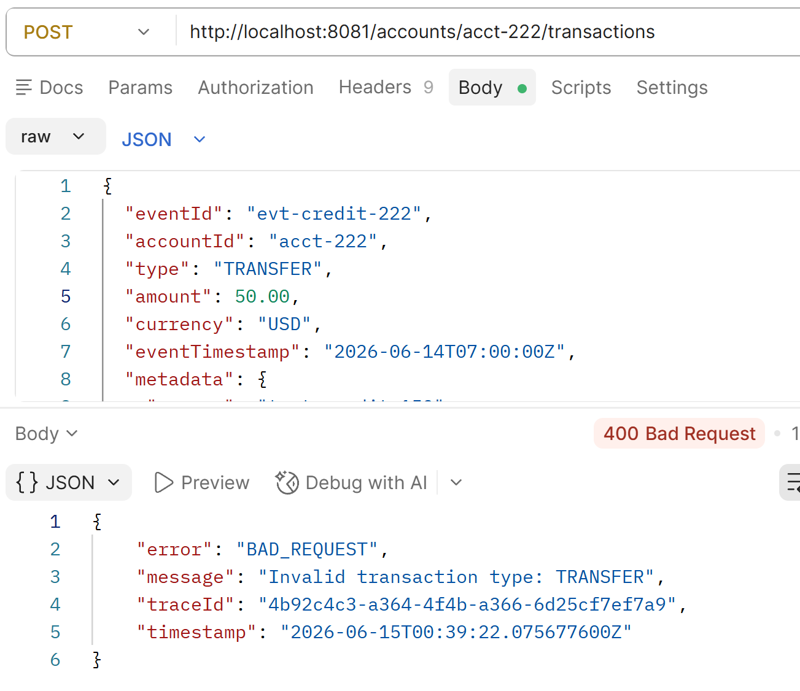
### 9. Missing required fields

- URL: `POST http://localhost:8081/accounts/acct-123/transactions`
- Sample body:
```json
{
  "type": "CREDIT",
  "amount": 25.00,
  "currency": "USD",
  "eventTimestamp": "2026-06-14T16:00:00Z"
}
```
- Expected:
  - HTTP `400 Bad Request`
  - Error indicates missing `eventId`
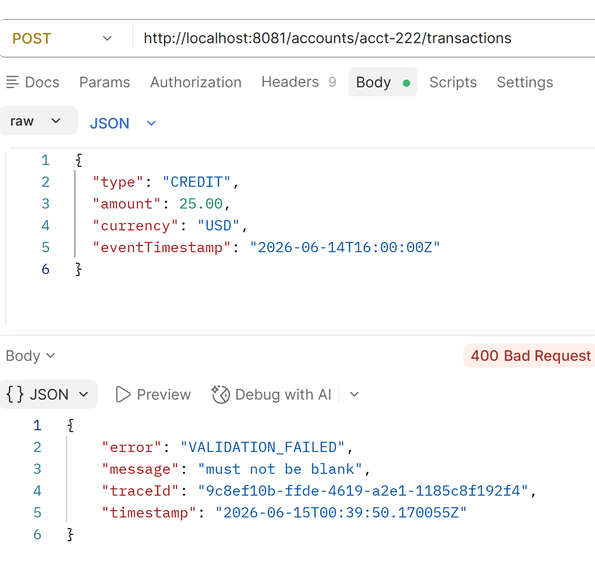
### 10. Missing account balance for unknown account

- URL: `GET http://localhost:8081/accounts/nonexistent-account/balance`
- Expected:
  - HTTP `404 Not Found`
  - Error indicates account not found
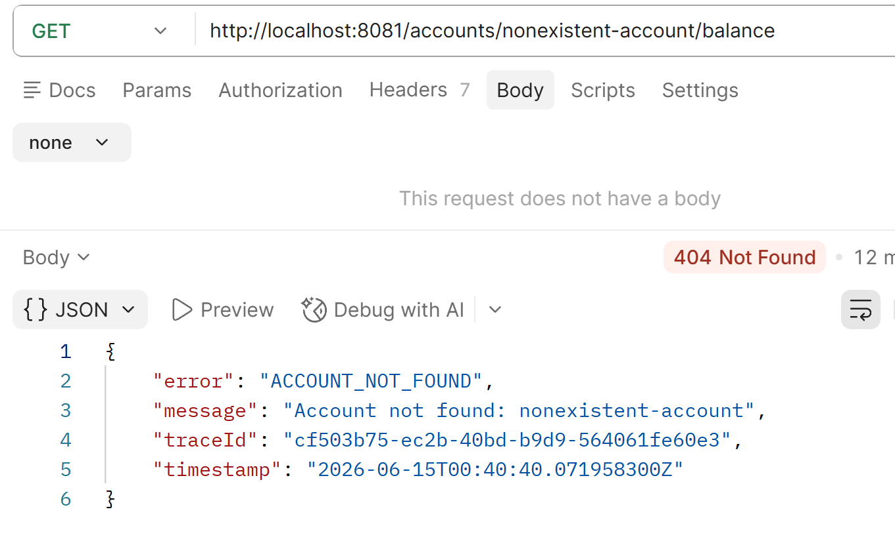
### 11. Health check

- URL: `GET http://localhost:8081/health`
- Expected:
  - HTTP `200 OK`
  - Response contains `status: UP`
  - Response includes `database: UP` when H2 is available
- 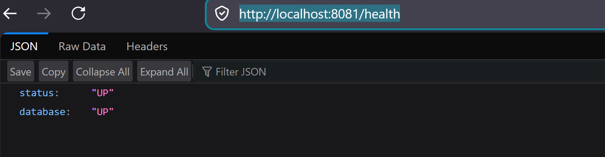

## Notes

- The account service is intended for internal use and is called by the public gateway service.
- `eventId` is the idempotency key and must be unique for each distinct transaction.
- Request tracing is supported via `X-Trace-Id` headers.
